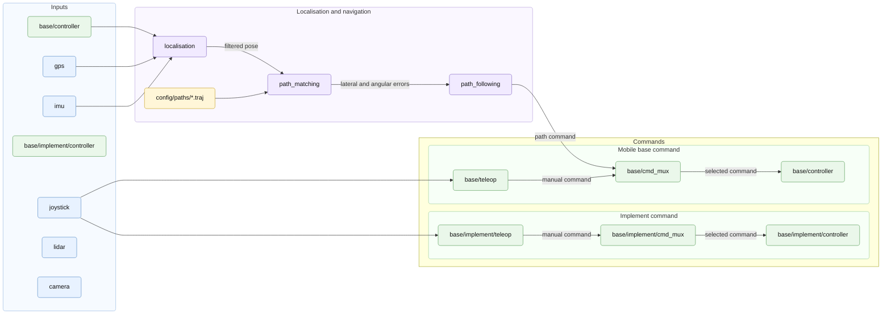

# Overview

This guide explains how to configure and launch a TIRREX demo from a directory
of YAML files.

TIRREX is built on top of the ROMEA ecosystem. ROMEA provides the robotics
software environment: reusable core libraries, ROS2 interfaces, robot
descriptions, drivers, controllers, simulation bridges and high-level
behaviours. TIRREX adds a user-facing layer on top of this environment so that a
complete demo can be assembled without writing new launch files for each
experiment.


## ROMEA Software Stack

ROMEA is organised in two complementary layers:

* `core` packages contain the reusable C++ logic: kinematic models, control
  algorithms, filtering, localisation, path following and common utilities.
  They do not depend on ROS2;
* ROS2 interface packages wrap this core logic into a running robot stack:
  nodes, launch files, URDF descriptions, ros2_control descriptions, messages,
  hardware plugins, simulation plugins and bridges.

In practice, the ROMEA / TIRREX workspace is organised around the following
software blocks:

| Block | Role |
| --- | --- |
| Core | Reusable models, algorithms and utilities independent from ROS2. |
| Controllers | Mobile base and actuator controllers exposed through ROS2 and ros2_control. |
| Drivers | ROS2 interfaces for sensors, mobile bases, hardware and simulator integration. |
| Teleoperation | Joystick and keyboard teleoperation tools for robots and implements. |
| Navigation | Localisation, path matching and path following packages. |

## Meta-Descriptions and Meta-Bringup

A strong convention of the ROMEA ROS2 stack is the pair
`meta-description` / `meta_bringup`.

A meta-description is a high-level YAML file that describes one component: a
mobile base, a joystick, a sensor, an arm or an implement. It contains the
component identity, the minimal configuration needed to select the right model,
its location in the robot, the launch profiles to include and the topics that
can be recorded.

A `meta_bringup` package reads this meta-description, completes the component
configuration and generates or launches the artifacts required by ROS2. Depending
on the component, those artifacts can be URDF descriptions, ros2_control
descriptions, parameter files and launch descriptions used to start drivers,
controllers, simulation bridges or other component-specific runtime nodes.

Generic device example:

```yaml
name: <device_name>
launch:
  - include:
      file: "$(find-pkg-share <device_meta_bringup>)/profile/<profile>.launch.py"
      arg:
        - name: <argument_name>
          value: <argument_value>
configuration:
  manufacturer: <manufacturer>
  model: <model>
  version: <version>
location:
  parent_link: <parent_link>
  xyz: [0.0, 0.0, 0.0]
  rpy: [0.0, 0.0, 0.0]
records:
  <topic_key>: true
```

The same principle is used across the workspace:

| Component | Meta-bringup package |
| --- | --- |
| Mobile base | `romea_mobile_base_meta_bringup` |
| Joystick | `romea_joystick_meta_bringup` |
| GPS | `romea_gps_meta_bringup` |
| IMU | `romea_imu_meta_bringup` |
| Lidar | `romea_lidar_meta_bringup` |
| Camera | `romea_camera_meta_bringup` |
| Arm | `romea_arm_meta_bringup` |
| Implement | `romea_implement_meta_bringup` |

This convention is specific to this workspace. It allows a demo to be configured
with a small set of YAML files instead of duplicating large launch files,
monolithic URDF files and hard-coded parameter files for every robot and every
experiment.

## TIRREX Demos

A TIRREX demo is primarily a directory containing configuration files and
meta-description files. These files describe the robot, its joystick, its
devices, the geographic anchor, the simulator setup, localisation parameters,
path following parameters and recording options.

`tirrex_core` is the generic orchestration layer above the ROMEA meta-bringup
packages and the packages used by the demos. It receives the path to a
configuration directory and assembles the robot launch context from the mobile
base, joystick and device files.

Then it delegates the launch work to the appropriate packages:

* meta-bringup packages compose the robot, generate descriptions and launch
  drivers, controllers or simulation bridges;
* localisation packages estimate the robot pose;
* path matching and path following packages handle navigation;
* standard ROS2 tools record and replay selected topics.

The configuration directory is the user input. It contains the files needed to
describe the demo, but it does not implement the launch logic itself.

This separation is important: the configuration files describe what should be
launched, while the meta-bringup and execution packages define how it is launched.

The reference demo used throughout this guide is `tirrex_adap2e`.

## Configuration Directory

```text
config/
  robot/
    base.yaml                 mobile base meta-description
    devices.yaml              index of available devices
    devices/
      <name>.<type>.yaml      device meta-descriptions
      *.joystick.yaml         joystick meta-description
      *.gps.yaml              GPS meta-description
      *.imu.yaml              IMU meta-description
      *.lidar.yaml            lidar meta-description
      *.camera.yaml           camera meta-description
      *.arm.yaml              manipulator meta-description
      *.implement.yaml        implement meta-description
    localisation.yaml         localisation node parameters
    path_following.yaml       path following node parameters
    path_matching.yaml        path matching node parameters
    teleop.yaml               teleoperation node parameters
  simulation.yaml             simulator worlds and entity poses
  wgs84_anchor.yaml           geographic anchor of the demo
  records.yaml                recording directory and options
  paths/
    *.traj                    paths used by navigation demos
```

Device files are named with the `<device_name>.<device_type>.yaml` convention.
For example, a GPS called `septentrio` is described by
`robot/devices/septentrio.gps.yaml`.

## Demo Launch Flow

The launch mode selects which execution environment must be started from the
same configuration directory.

| Mode | Meaning |
| --- | --- |
| `live` | Start the robot drivers and live nodes. |
| `simulation` | Select an available Gazebo backend automatically. |
| `simulation_gazebo_classic` | Use Gazebo Classic explicitly. |
| `simulation_gazebo` | Use Gazebo explicitly. |
| `simulation_isaac` | Reserved for Isaac Sim integration. |

Typical generic command:

```bash
ros2 launch tirrex_core demo.launch.py \
  demo:=my_demo \
  demo_start_timestamp:=manual \
  demo_configuration_directory:=/path/to/config \
  robot_namespace:=robot \
  mode:=simulation \
  record:=false
```

When a demo starts, TIRREX launches the sensors declared by the robot
configuration, the mobile base controller, and the optional implement
controller. The localisation and navigation part fuses GPS, IMU and mobile base
odometry feedback to estimate the robot pose, then uses this pose and the
selected trajectory to compute a navigation command. These parts are detailed in
Sections 4 and 5.

Other sensors, such as cameras and lidars, can also be launched by the same
configuration mechanism. They are shown as inputs, but they are not
connected to a downstream block in this diagram because the current ROMEA
ecosystem does not provide a dedicated perception algorithm for these
modalities.

Manual control follows another path. The joystick feeds the teleoperation node,
which sends manual commands to `base/cmd_mux`. The command multiplexer selects
between manual commands and path-following commands, then sends the selected
command to `base/controller`. The controller applies this command to the mobile
base and publishes odometry feedback used by localisation. When an implement is
present, the same joystick can also feed `base/implement/teleop`; the implement
command is then routed through `base/implement/cmd_mux` before reaching
`base/implement/controller`. The implement controller feedback is shown as an
available input because the controller can publish it, even if this feedback is
not consumed by the localisation and navigation pipeline in this diagram.

Figure 2 - Typical demo execution:



The following sections explain how each part of this demo is configured: the
robot and its devices, the geographic anchor, localisation, path following,
teleoperation, simulation, recording and the creation of a new demo
configuration.
