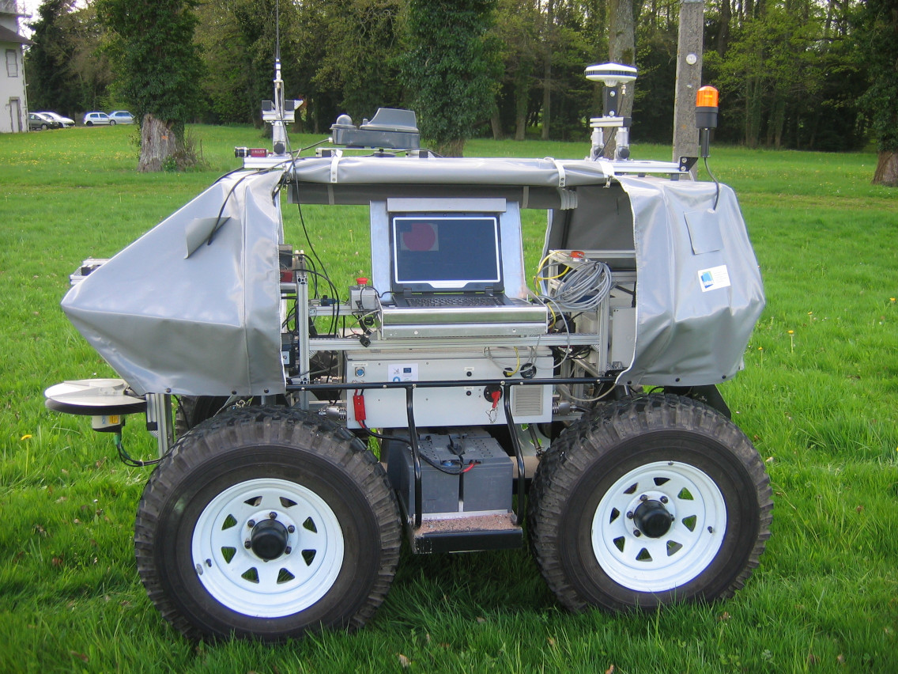
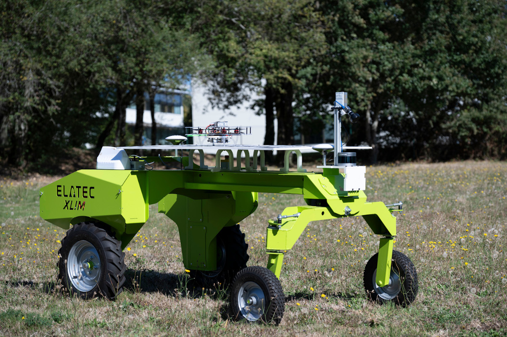
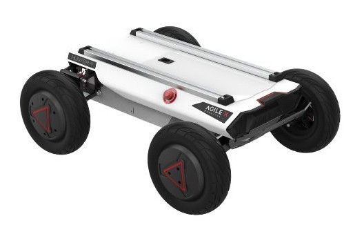
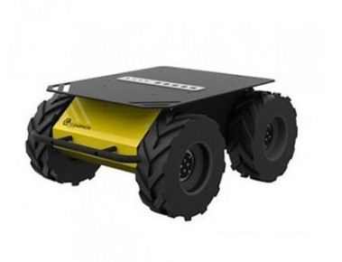
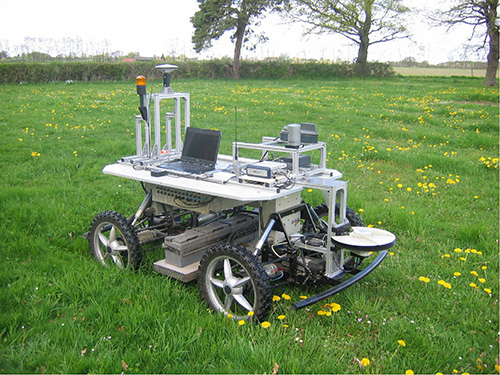
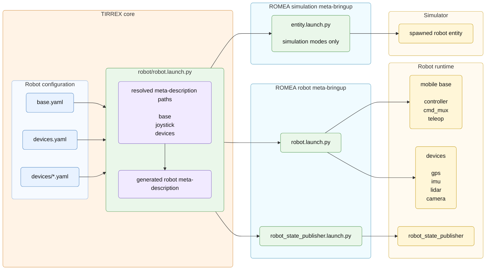

# Robot Configuration

## Principle

In the ROMEA / TIRREX workspace, a robot is described as a complete robotic
system rather than only as a mobile base or a manipulator. It is composed of one
mobile base, one teleoperation device, optional sensors such as GPS, IMU, lidar
or camera devices, optional implements, and optional manipulator arms.

This definition is intentionally broader than in many robotics projects, where
only the mobile base or the manipulator arm is described as the robot. For a
TIRREX demo, the robot configuration describes the complete set of components
that must be assembled and launched around the physical or simulated robot.

## Configuration

Robot configuration is stored under:

```text
config/
  robot/
    base.yaml                 mobile base meta-description
    devices.yaml              device index
    devices/
      <device_name>.<type>.yaml
```

This chapter covers the mobile base and the device meta-descriptions commonly
used by a TIRREX demo. Each device file follows the same idea: select a model,
define where it is attached on the robot, choose the launch profiles to include
and declare recordable topics.

### Mobile Base

```text
config/
  robot/
    base.yaml                 edited in this section
```

`base.yaml` is the mobile base meta-description consumed by
`romea_mobile_base_meta_bringup`. It selects the robot description, controller
configuration, hardware or simulation interfaces and teleoperation parameters.
For more details about the mobile base format, see the
`romea_mobile_base_meta_bringup` and `romea_mobile_base_description` README
files.

Example from `tirrex_adap2e`:

```yaml
name: "base"
launch:
  - include:
      file: "$(find-pkg-share romea_mobile_base_meta_bringup)/profile/robot.launch.py"
      arg:
        - name: "joystick_topic"
          value: "/adap2e/joystick/joy"
configuration:
  manufacturer: inrae
  model: adap2e
  version: one
records:
  joint_states: true
  controller/odom: true
  controller/odometry: true
  controller/kinematic: true
```

Important fields:

| Key | Meaning |
| --- | --- |
| `name` | Base name used in namespaces and topic prefixes. |
| `launch` | Launch profiles included by the mobile base meta-bringup package. |
| `manufacturer` | Manufacturer used to locate robot-specific packages. |
| `model` | Robot model used to select description, bringup and hardware packages. |
| `version` | Optional robot variant. |
| `records` | Logical base topics that can be recorded. |

Supported mobile bases currently present in the workspace include:

| Mobile base | Manufacturer | Model | Versions or variants |
| --- | --- | --- | --- |
| Adap2e | `inrae` | `adap2e` | `one`, `two` |
| Aroco | `inrae` | `aroco` | default |
| Campero | `robotnik` | `campero` | `rubber`, `mecanum` |
| Ceol | `agreenculture` | `ceol` | default |
| Cinteo | `xlim` | `cinteo` | default |
| EffibotE3 | `effidence` | `effibote3` | default |
| Hunter | `agilex` | `hunter` | default |
| Husky | `clearpath_robotics` | `husky` | default |
| POM | `inrae` | `pom` | `basic`, `4x4` |
| Robucar | `robosoft` | `robucar` | default |
| Scout | `agilex` | `scout` | `mini`, `v2` |

Robot examples:

| Adap2e | Aroco | Cinteo |
| :---: | :---: | :---: |
| {height=3cm} | {height=3cm} | {height=3cm} |

| Hunter | Husky | Scout |
| :---: | :---: | :---: |
| {width=5cm} | {width=5cm} | {width=5cm} |

| POM basic | POM 4x4 | Robucar |
| :---: | :---: | :---: |
| {height=3cm} | {height=3cm} | {height=3cm} |

### Devices Index

```text
config/
  robot/
    devices.yaml              edited in this section
    devices/
      <device_name>.<type>.yaml
```

`devices.yaml` tells `tirrex_core` which devices exist in the demo and in which
launch modes they are available. It is the quick enable/disable layer: a device
can be kept in the configuration directory while being excluded from live or
simulation runs.

```yaml
remote_controller:
  type: joystick
  available_mode: all
lms151:
  type: lidar
  available_mode: all
septentrio:
  type: gps
  available_mode: all
xsens:
  type: imu
  available_mode: all
ur10:
  type: arm
  available_mode: none
realsense:
  type: camera
  available_mode: none
cultivator:
  type: implement
  available_mode: simulation
```

Each listed device must have a matching file named:

```text
config/robot/devices/<device_name>.<device_type>.yaml
```

The `<device_name>` part is the instance name used by the demo, while
`<device_type>` selects the ROMEA device family. This means that a robot can
declare several devices of the same type: for example two GPS receivers, several
lidars, or multiple cameras. Each instance gets its own entry in `devices.yaml`
and its own meta-description file.

Common `available_mode` values:

| Value | Meaning |
| --- | --- |
| `all` | Device is available in every mode. |
| `live` | Device is only available on the real robot. |
| `simulation` | Device is only available in simulation modes. |
| `simulation_gazebo` | Device is only available with Gazebo. |
| `simulation_gazebo_classic` | Device is only available with Gazebo Classic. |
| `none` | Device exists in the demo but is not launched by default. |

### Joystick

```text
config/
  robot/
    devices.yaml
    devices/
      remote_controller.joystick.yaml     edited in this section
```

A demo must provide exactly one available joystick for the selected launch mode.
The joystick meta-description selects either a physical joystick driver or a
keyboard teleoperation profile, while the mapping files are provided by
`romea_joystick_utils`.

```yaml
name: "joystick"
launch:
  - include:
      file: "$(find-pkg-share romea_joystick_meta_bringup)/profile/joy.launch.py"
      if: $(eval "'$(var manufacturer)' != 'any'")
  - include:
      file: "$(find-pkg-share romea_joystick_meta_bringup)/profile/pynput_teleop.launch.py"
      if: $(eval "'$(var manufacturer)' == 'any'")
configuration:
  manufacturer: microsoft
  model: xbox
  rate: 10
records:
  joy: true
```

Common joystick models are `microsoft/xbox`, `sony/dualshock4` and
`any/keyboard`. The default mobile base teleoperation remapping files are in
`romea_mobile_base_teleop/config`, while joystick hardware mappings are in
`romea_joystick_utils/config`.

### GPS

```text
config/
  robot/
    devices.yaml
    devices/
      septentrio.gps.yaml       edited in this section
```

The GPS meta-description selects a receiver, optional antennas, live or
simulation launch profiles, and the records associated with the GPS topics. GPS
localisation plugins are explained in the localisation chapter.

```yaml
name: gps
launch:
  - group:
      children:
        - include:
            file: "$(find-pkg-share romea_gps_meta_bringup)/profile/romea_gps_serial_driver.launch.py"
            arg:
              - name: device
                value: /dev/ttyUSB0
              - name: baudrate
                value: "115200"
        - include:
            file: "$(find-pkg-share romea_gps_meta_bringup)/profile/ntrip_client.launch.py"
            arg:
              - name: mountpoint
                value: AUTO
      if: $(eval "'$(var mode)' == 'live'")
  - include:
      file: "$(find-pkg-share romea_gps_meta_bringup)/profile/gz_bridge.launch.py"
      if: $(eval "'$(var mode)' == 'simulation_gazebo'")
configuration:
  manufacturer: septentrio
  model: asterx
  rate: 10
  dual_antenna: true
location:
  parent_link: "base_link"
  xyz: [0.0, 0.0, 1.5]
records:
  nmea_sentence: true
  gps_fix: false
  vel: false
```

Supported receiver families include `septentrio/asterx`, `ublox/evk_m8`,
`drotek/f9p` and `ashtech/proflex_800`. See `romea_gps_meta_bringup` and
`romea_gps_description` for the complete receiver, antenna and launch profile
formats.

Several launch profiles can be used to communicate with GPS receivers or related
services:

| Profile | Purpose |
| --- | --- |
| `romea_gps_serial_driver.launch.py` | Serial GPS receiver driver. |
| `romea_gps_tcp_driver.launch.py` | TCP GPS receiver driver. |
| `nmea_navsat_driver.launch.py` | Generic NMEA driver. |
| `ntrip_client.launch.py` | NTRIP correction client. |
| `gz_bridge.launch.py` | Gazebo simulation bridge. |
| `localisation_plugin.launch.py` | GPS observation plugin for localisation. |

Unlike most devices, the GPS location only provides `xyz`. It gives the antenna
position, or the main antenna position for a dual-antenna receiver. The GPS
heading is then interpreted from the parent link axis.

### IMU

```text
config/
  robot/
    devices.yaml
    devices/
      xsens.imu.yaml            edited in this section
```

The IMU meta-description selects the IMU model, its pose on the robot and the
driver or bridge profiles to launch. IMU localisation plugins are explained in
the localisation chapter.

```yaml
name: "imu"
launch:
  - include:
      file: "$(find-pkg-share romea_imu_meta_bringup)/profile/xsens_driver.launch.py"
      arg:
        - name: device
          value: /dev/ttyUSB0
        - name: baudrate
          value: "115200"
  - include:
      file: "$(find-pkg-share romea_imu_meta_bringup)/profile/gz_bridge.launch.py"
      if: $(eval "'$(var mode)' == 'simulation_gazebo'")
configuration:
  manufacturer: xsens
  model: mti
  rate: 100
location:
  parent_link: "base_link"
  xyz: [0.0, 0.0, 0.7]
  rpy: [0.0, 0.0, 0.0]
records:
  data: true
```

Supported IMU families include `xsens/mti`, `xsens/mti_6xx`,
`unitree/b1` and `gladiator/landmark_x0`. See `romea_imu_meta_bringup` and
`romea_imu_description` for details.

Supported IMU launch profiles include:

| Profile | Purpose |
| --- | --- |
| `xsens_driver.launch.py` | Xsens IMU driver. |
| `bluespace_ai_xsens_mti_driver.launch.py` | Alternative Xsens MTI driver. |
| `gz_bridge.launch.py` | Gazebo simulation bridge. |
| `localisation_plugin.launch.py` | IMU observation plugin for localisation. |

### Lidar

```text
config/
  robot/
    devices.yaml
    devices/
      lms151.lidar.yaml         edited in this section
```

The lidar meta-description selects the lidar model, its pose on the robot,
driver or simulation bridge launch profiles, and recordable scan or point cloud
topics.

```yaml
name: "lidar"
launch:
  - include:
      file: "$(find-pkg-share romea_lidar_meta_bringup)/profile/sick_scan_xd_lms1xx.launch.py"
      arg:
        - name: ip
          value: "192.168.1.112"
        - name: port
          value: "2112"
  - include:
      file: "$(find-pkg-share romea_lidar_meta_bringup)/profile/gz_bridge.launch.py"
      if: $(eval "'$(var mode)' == 'simulation_gazebo'")
configuration:
  manufacturer: sick
  model: lms
  version: 151
  rate: 50
  resolution: 0.5
location:
  parent_link: "base_link"
  xyz: [2.02, 0.0, 0.34]
  rpy: [0.0, 0.0, 0.0]
records:
  scan: true
  cloud: false
```

Supported lidar families include `sick/lms`, `sick/mrs`, `sick/tim`,
`ouster/os` and `robosense/airy`. See `romea_lidar_meta_bringup` and
`romea_lidar_description` for the full model and launch profile formats.

Supported lidar launch profiles include:

| Profile | Purpose |
| --- | --- |
| `sick_scan_xd_lms1xx.launch.py` | SICK LMS 1xx driver. |
| `sick_scan_xd_mrs1xxx.launch.py` | SICK MRS 1xxx driver. |
| `sick_scan_xd_mrs6xxx.launch.py` | SICK MRS 6xxx driver. |
| `sick_scan_xd_tim5xx.launch.py` | SICK TiM 5xx driver. |
| `ouster_ros_driver.launch.py` | Ouster lidar driver. |
| `gz_bridge.launch.py` | Gazebo simulation bridge. |

### Camera

```text
config/
  robot/
    devices.yaml
    devices/
      realsense.camera.yaml     edited in this section
```

The camera meta-description selects the camera family, enabled streams, pose on
the robot, driver or simulation bridge profiles, and recordable image or point
cloud topics.

```yaml
name: "rgbd_camera"
launch:
  - include:
      file: "$(find-pkg-share romea_camera_meta_bringup)/profile/realsense2_camera.launch.py"
  - include:
      file: "$(find-pkg-share romea_camera_meta_bringup)/profile/gz_bridge.launch.py"
      if: $(eval "'$(var mode)' == 'simulation_gazebo'")
configuration:
  manufacturer: intel
  model: realsense
  version: d435
  rgb_camera:
    resolution: 1280x720
  infrared_camera:
    resolution: 1280x720
  depth_camera:
    resolution: 1280x720
location:
  parent_link: "base_link"
  xyz: [1.42, 0.0, 1.14]
  rpy: [0.0, 20.0, 0.0]
records:
  rgb/camera_info: false
  rgb/image_raw: true
  depth/camera_info: false
  depth/image_raw: true
  point_cloud/points: true
```

A monocular camera follows the same structure with a simpler configuration:

```yaml
name: "front_camera"
launch:
  - include:
      file: "$(find-pkg-share romea_camera_meta_bringup)/profile/usb_cam.launch.py"
configuration:
  manufacturer: axis
  model: p1346
  rate: 30
location:
  parent_link: "base_link"
  xyz: [1.0, 0.0, 1.2]
  rpy: [0.0, 0.0, 0.0]
records:
  camera_info: false
  image_raw: true
```

Supported camera families include `intel/realsense`, `stereolabs/zed` and
`axis/p1346`. See `romea_camera_meta_bringup` and `romea_camera_description`
for stream-specific configuration rules.

Supported camera launch profiles include:

| Profile | Purpose |
| --- | --- |
| `realsense2_camera.launch.py` | Intel RealSense driver. |
| `usb_cam.launch.py` | Generic USB camera driver. |
| `gz_bridge.launch.py` | Gazebo simulation bridge. |

### Manipulator

```text
config/
  robot/
    devices.yaml
    devices/
      ur10.arm.yaml             edited in this section
```

An arm contributes URDF fragments, ros2_control information, launch profiles and
joint states. The arm meta-description selects the manipulator model, its pose
on the robot and the driver or simulation profile.

```yaml
name: arm
launch:
  - include:
      file: "$(find-pkg-share romea_arm_meta_bringup)/profile/ur.launch.py"
      arg:
        - name: ip
          value: "1.1.1.1"
configuration:
  manufacturer: universal_robots
  model: ur
  version: "10"
location:
  parent_link: "base_link"
  xyz: [2.02, 0.0, 0.54]
  rpy: [0.0, 0.0, 0.0]
simulation:
  initial_joint_positions:
    shoulder_pan_joint: 0.0
    shoulder_lift_joint: -80.0
    elbow_joint: 155.0
    wrist_1_joint: 90.0
    wrist_2_joint: -90.0
    wrist_3_joint: 0.0
records:
  joint_states: false
```

The current arm support targets Universal Robots arms through
`romea_arm_meta_bringup`.

Supported arm launch profiles include:

| Profile | Purpose |
| --- | --- |
| `ur.launch.py` | Universal Robots driver, controller and simulation setup. |

### Implement

```text
config/
  robot/
    devices.yaml
    devices/
      cultivator.implement.yaml     edited in this section
```

An implement can be passive, active or intelligent. A passive implement mostly
contributes geometry and transforms. An active or intelligent implement can also
contribute launch files for communication, control nodes or simulation bridges.

```yaml
name: cultivator
configuration:
  model: cultivator
  version: mounted
location:
  parent_link: "implement_link"
  xyz: [0.0, 0.0, 0.0]
  rpy: [0.0, 0.0, 0.0]
records:
  joint_states: false
```

See `romea_implement_meta_bringup` and `romea_implement_description` for the
supported implement description format.

## Launch Flow

The robot launch starts from the robot configuration directory. TIRREX reads
`base.yaml`, `devices.yaml` and the matching device meta-description files, then
generates a complete robot meta-description. The ROMEA robot meta-bringup
package consumes this generated file to compose the robot description and launch
the selected mobile base, joystick, sensor, arm and implement profiles.

Figure 3 - Robot configuration launch flow:



The generated robot meta-description is different from the individual device
meta-descriptions shown above. A device meta-description describes one device
instance. The robot meta-description is a composition file generated by TIRREX
from the selected base, joystick and available device files.

Its structure is deliberately small:

```yaml
base:
  meta_description: config/robot/base.yaml

joystick:
  meta_description: config/robot/devices/remote_controller.joystick.yaml

devices:
  - type: gps
    meta_description: config/robot/devices/septentrio.gps.yaml
  - type: imu
    meta_description: config/robot/devices/xsens.imu.yaml
  - type: lidar
    meta_description: config/robot/devices/lms151.lidar.yaml
  - type: implement
    meta_description: config/robot/devices/cultivator.implement.yaml
```

This generated file is passed to the ROMEA robot meta-bringup package, which
launches the mobile base controllers, teleoperation nodes, device drivers,
simulation bridges and `robot_state_publisher` according to the selected launch
mode. In simulation modes, TIRREX also passes the same generated file to
`romea_simulation_meta_bringup`, which generates and spawns the simulated robot
entity with its devices.
