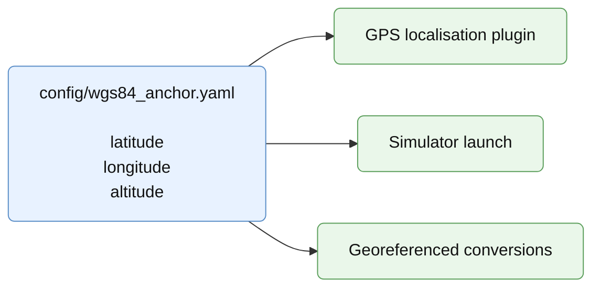

# Geographic Anchor Configuration

## Configuration

Geographic anchor configuration uses:

```text
config/
  wgs84_anchor.yaml            edited in this chapter
```

The geographic anchor defines where the demonstration takes place on Earth. It
is shared by localisation and simulation so that robot poses, real GPS data,
simulated GPS data and geographic conversions use the same reference.

Example:

```yaml
latitude: 45.76345967
longitude: 3.10955017
altitude: 351.9
```

The anchor is expressed in WGS84 coordinates.

## Where It Is Used

There is no dedicated launch file for the geographic anchor. It is a shared
configuration file consumed by launch files and nodes that need a global
reference. It is used by GPS localisation plugins to convert WGS84 positions
into the local ENU frame, by simulator launch files to initialise the simulated
world geographic reference, and by other !noeuds ros2 qui ont besoin de georeferenced conversions when needed.

Figure 4 - Geographic anchor usage:


