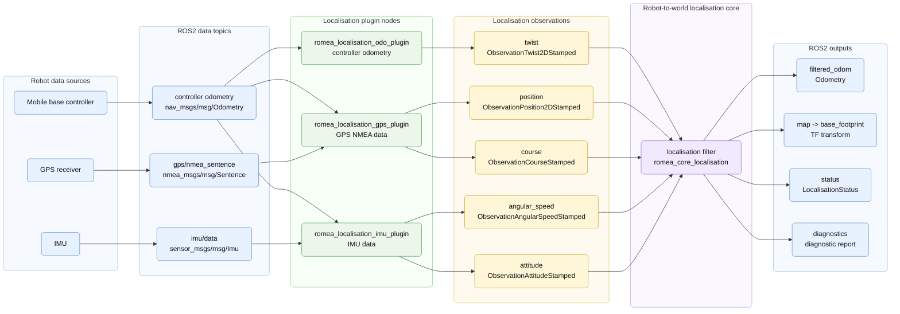
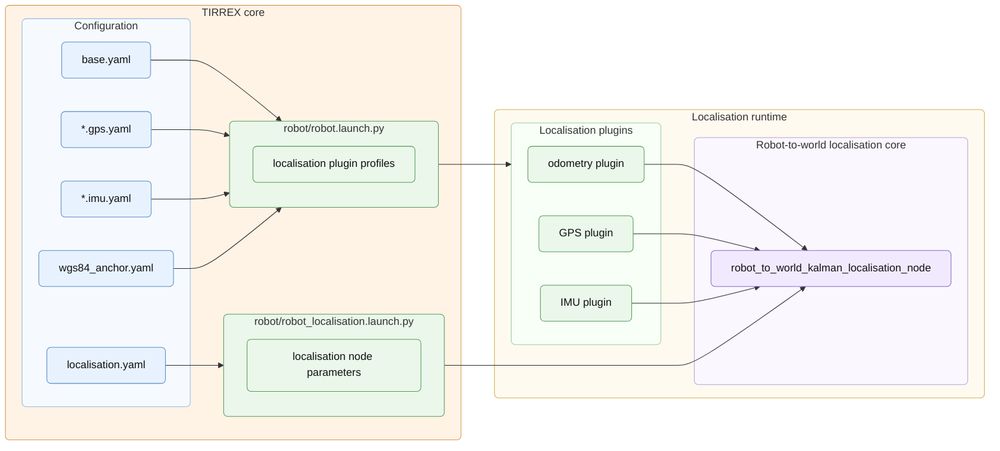

# Localisation Configuration

## Principle

Localisation estimates the robot pose in a local metric frame. In TIRREX, this
frame is an ENU frame attached to the WGS84 anchor defined by the demo. The
anchor latitude, longitude and altitude define the geographic position of the
local origin, which corresponds to `(0, 0, 0)` in the ENU frame.

The localisation pipeline is organised in three steps. First, sensors and
controllers publish ROS2 data such as mobile base odometry, NMEA sentences or
IMU measurements. Then localisation plugins convert these data streams into
typed localisation observations. Finally, the robot-to-world Kalman filter fuses
these observations and publishes the filtered robot pose, odometry, TF
transform, status and diagnostics.

Figure 5 - Localisation data flow:




## Configuration

Configuring localisation therefore involves several files. The WGS84 anchor is
defined once for the demo, as described in the previous chapter. The Kalman
filter is configured in `robot/localisation.yaml`, and the localisation plugin
launch profiles are declared in the meta-descriptions of the mobile base, GPS
receivers and IMUs:

```text
config/
  wgs84_anchor.yaml            geographic reference defined before localisation
  robot/
    localisation.yaml          edited in this chapter
    base.yaml                  mobile base launch profiles
    devices/
      *.gps.yaml               GPS launch profiles
      *.imu.yaml               IMU launch profiles
```

The TIRREX localisation launch file starts `romea_robot_to_world_localisation_core/robot_to_world_kalman_localisation_node` under the robot namespace, in the `localisation` namespace. It also sets the robot base frame from the selected robot namespace.

This node does not read sensors directly. It consumes typed observations from `romea_localisation_msgs` and feeds them to the robot-to-world Kalman filter.

The geographic anchor must be defined before localisation because GPS
observations are converted from WGS84 coordinates into the local ENU frame used
by the filter.

Example `localisation.yaml`:

```yaml
filter:
  state_pool_size: 1000
predictor:
  maximal_dead_recknoning_travelled_distance: 2.
  maximal_dead_recknoning_elapsed_time: 10.
angular_speed_updater:
  minimal_rate: 10
twist_updater:
  minimal_rate: 0
linear_speeds_updater:
  minimal_rate: 10
position_updater:
  minimal_rate: 1
  trigger: always
course_updater:
  minimal_rate: 1
  trigger: once
pose_updater:
  minimal_rate: 0
  trigger: always
attitude_updater:
  minimal_rate: 10
publish_rate: 10
debug: true
```

This file configures the filter itself and declares which observation updaters
are used for data fusion. In the example above, the filter uses angular speed,
left/right linear speeds, GPS position, GPS course and IMU attitude. The full
twist updater is disabled because its `minimal_rate` is set to `0`.

In this configuration, the filter reconstructs the robot motion from
`linear_speeds_updater` and `angular_speed_updater`, using observations produced
by two different plugins: the mobile base odometry plugin and the IMU
localisation plugin. If no IMU is available, a simpler configuration can use
`twist_updater` instead, which consumes the complete twist observation produced
by the odometry plugin. The same idea applies to absolute pose information: this
example uses `position_updater` and `course_updater` because position and course
are produced separately from NMEA data. If a sensor or another algorithm
publishes a complete pose observation, `pose_updater` can be used directly.

| Parameter | Meaning |
| --------- | ------- |
| `filter.state_pool_size` | Number of timestamped states kept by the asynchronous Kalman filter. |
| `predictor.maximal_dead_recknoning_travelled_distance` | Maximum travelled distance allowed while the filter is only dead-reckoning. |
| `predictor.maximal_dead_recknoning_elapsed_time` | Maximum elapsed time allowed while the filter is only dead-reckoning. |
| `<updater>.minimal_rate` | Minimal expected observation rate. A value of `0` disables the updater. |
| `<updater>.trigger` | Update policy for exteroceptive observations. `always` uses every valid observation; `once` uses the first valid observation, typically for initialisation. |
| `<updater>.mahalanobis_distance_rejection_threshold` | Optional outlier rejection threshold for pose-related observations. |
| `publish_rate` | Rate used to publish filtered odometry, status and diagnostics. |
| `debug` | Enables localisation debug outputs when supported by the node. |

The dead-reckoning limits protect the localisation from running indefinitely on
motion prediction only. If the travelled distance or elapsed time limits are
exceeded while no valid exteroceptive observation is available, the localisation
is reset. It can start again only when the observations required for
initialisation become available again.

The `minimal_rate` of each updater is also part of the filter integrity checks.
When an updater does not receive data at the expected rate, its observations are
not used. Depending on the role of this updater, this can prevent the filter
from starting or force a reset while the filter is already running.

Exteroceptive updaters, such as position, course or pose, also use a
Mahalanobis distance test. This rejects observations that are inconsistent with
the current filter state. Rejected observations are not used to update the
filter, so the localisation continues in dead-reckoning until a valid
exteroceptive observation is accepted.

For absolute pose information, use either `pose_updater` when a single source
provides a complete pose observation, or a combination of `position_updater` and
`course_updater` when position and course come from different sources.

The most common updaters are:

| Updater | Observation topic | Typical producer |
| ------- | ----------------- | ---------------- |
| `twist_updater` | `twist` | Mobile base odometry plugin. |
| `linear_speed_updater` | `twist` | Mobile base odometry plugin, when a single longitudinal speed is used. |
| `linear_speeds_updater` | `twist` | Mobile base odometry plugin, when left/right speeds are used. |
| `angular_speed_updater` | `angular_speed` | IMU localisation plugin. |
| `attitude_updater` | `attitude` | IMU localisation plugin. |
| `position_updater` | `position` | GPS localisation plugin. |
| `course_updater` | `course` | GPS localisation plugin. |
| `range_updater` | `range` | Optional RTLS localisation plugin. |
| `pose_updater` | `pose` | Optional pose-producing localisation plugin. |

## Launch Flow

The localisation runtime is assembled by two TIRREX launch files.
`robot/robot.launch.py` starts the mobile base, GPS and IMU localisation plugins
through the corresponding meta-description launch profiles. These plugins
convert raw ROS2 topics into typed localisation observations. In parallel,
`robot/robot_localisation.launch.py` starts the robot-to-world Kalman
localisation node from `robot/localisation.yaml`. The Kalman node then consumes
the observations produced by the plugins.

Figure 6 - Localisation launch flow:



## Localisation Plugin Profiles

The Kalman filter consumes observations, not raw sensor messages. The
localisation plugins that produce these observations must therefore be launched
from the corresponding mobile base, GPS and IMU meta-descriptions.

Typical localisation plugin launch entries:

```yaml
# Mobile base meta-description
launch:
  - include:
      file: "$(find-pkg-share romea_mobile_base_meta_bringup)/profile/localisation_plugin.launch.py"
      arg:
        - name: controller_topic
          value: odom
```

The mobile base profile starts the odometry localisation plugin. It subscribes
to the selected controller topic and publishes the motion observations used by
the `twist_updater`, `linear_speed_updater` or `linear_speeds_updater`.

```yaml
# GPS device meta-description
launch:
  - include:
      file: "$(find-pkg-share romea_gps_meta_bringup)/profile/localisation_plugin.launch.py"
      arg:
        - name: wgs84_anchor_file_path
          value: $(var wgs84_anchor_file_path)
        - name: odom_topic
          value: /$(var robot_namespace)/base/controller/odom
```

The GPS profile starts either the single-antenna or dual-antenna GPS
localisation plugin, depending on the GPS device configuration. The plugin uses
`wgs84_anchor.yaml` to express GPS fixes in the local ENU frame. A
single-antenna GPS also uses vehicle odometry to determine whether the robot is
moving forward or backward before converting GPS track angle into robot course.

```yaml
# IMU device meta-description
launch:
  - include:
      file: "$(find-pkg-share romea_imu_meta_bringup)/profile/localisation_plugin.launch.py"
      arg:
        - name: odom_topic
          value: /$(var robot_namespace)/base/controller/odom
```

The IMU profile starts the IMU localisation plugin. It publishes angular speed
and attitude observations. The odometry input is used to detect stationary
phases and support angular speed bias estimation.
