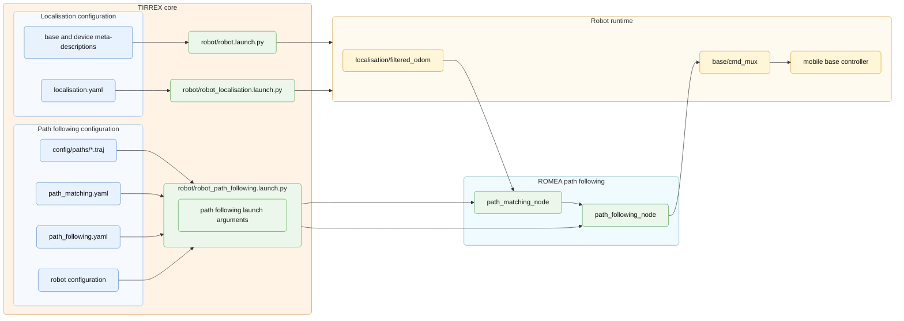
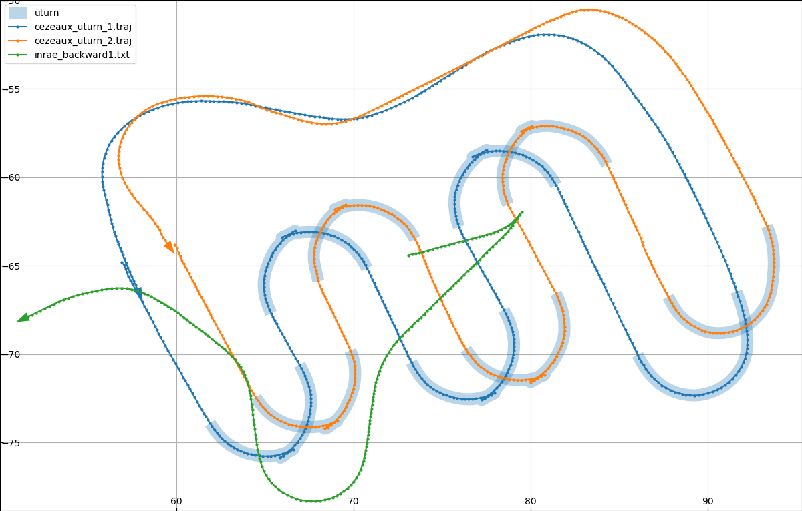
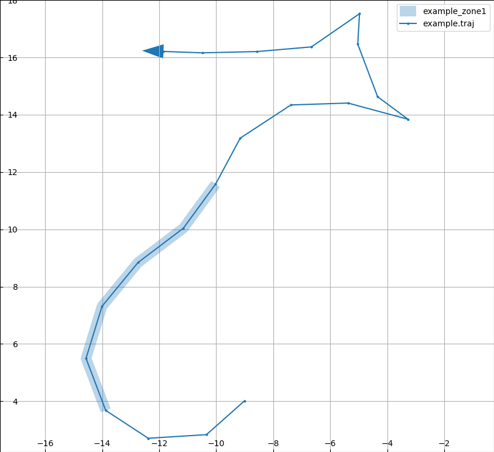

# Path Following

## Principle

The purpose of path following is to guide the robot along a planned trajectory.
TIRREX uses two complementary nodes for this task: path matching and path
following. The trajectory is stored as a path file in the demo configuration and
is expressed in the same local metric frame as the localisation output, usually
the ENU frame attached to the WGS84 anchor.

The path matching node first projects the current filtered robot pose onto the
selected trajectory. It estimates where the robot is on the path and computes
path-relative quantities such as curvilinear abscissa, lateral deviation and
course deviation. The path following node then uses these quantities, together
with its control parameters, to compute the command expected by the selected
mobile base controller.

The resulting command is not sent directly to the controller. It is published
through the mobile base command multiplexer so that autonomous path following
can coexist with teleoperation and other command sources.

## Configuration

Path following uses:

```text
config/
  robot/
    path_matching.yaml         path selection and matching options
    path_following.yaml        controller parameters
  paths/
    cezeaux_slam1.traj         path used by launch argument `path`
```

These files select the trajectory, configure the matching step and tune the
controller that produces mobile base commands.

### Trajectory File Format

The trajectory format used by the ROMEA path tools is a JSON format stored with
the `.traj` extension.

Two trajectory versions are currently usable: version 2, which represents a
continuous sampled path, and version 4, which represents an agricultural
trajectory as a sequence of row and turn segments.

#### Version 2

Version 2 describes a continuous trajectory sampled as a list of waypoints. Each
waypoint is expressed in a Cartesian frame whose origin is defined by the
geographic anchor. The trajectory can include a desired speed column, and can be
split into several sections. Sections are useful when the robot changes its
driving direction, for example during a  ! dre maneuvre en 3 ... U-turn where one section may be followed
with a negative speed.

Annotations can also be attached to trajectory points through their
`point_index`. They make it possible to mark where an implement-related action
should occur, for example entering or leaving a work zone, lowering a tool,
raising it, or activating it.

In version 2, a `.traj` file contains:

| Field | Meaning |
| ----- | ------- |
| `version` | Trajectory format version. |
| `origin` | Geographic anchor of the trajectory. The supported type is `WGS84`, with coordinates `[latitude, longitude, altitude]`. |
| `points.columns` | Names of the values stored for each waypoint. At least `x` and `y` are required; `speed` is commonly added. |
| `points.values` | Waypoint values. The `x` and `y` coordinates are expressed in the local ENU frame attached to `origin`. |
| `sections` | Indexes of the points that start each trajectory section. The first section must start at index `0`. |
| `annotations` | Optional annotations associated with trajectory point indexes, for example to mark zones or implement actions along the trajectory. |

Minimal example:

```json
{
  "version": "2",
  "origin": {
    "type": "WGS84",
    "coordinates": [45.76345967, 3.10955017, 351.9]
  },
  "points": {
    "columns": ["x", "y", "speed"],
    "values": [
      [0.0, 0.0, 1.0],
      [1.0, 0.0, 1.0],
      [2.0, 0.5, 0.8]
    ]
  },
  "sections": [0],
  "annotations": []
}
```

#### Version 4

The version 4 format keeps the same `.traj` extension but changes the structure
to describe agricultural trajectories as a sequence of segments:

| Field | Meaning |
| ----- | ------- |
| `version` | Trajectory format version. Version 4 files use `"4"`. |
| `file_type` | Mission file type. The path tools write `mission_order`. |
| `origin` | Geographic anchor of the trajectory. The supported type remains `WGS84`, but `coordinates` becomes an object with `lat`, `lon` and `alt`. |
| `robot` | Optional robot description copied by the generator when a robot configuration is provided. |
| `points` | Ordered list of trajectory segments. Supported segment types are `row_path`, `row_line` and `turn_path`. |

`row_path` and `turn_path` store explicit path points. `row_line` stores only
the start and end of a crop row; the tool reconstructs intermediate points when
the file is loaded. Version 4 also defines `turn_segment`, but importing such a
file requires precomputed turn geometry, so generated files intended for loading
should use `turn_path` when turn points are needed.

Minimal version 4 example:

```json
{
  "version": "4",
  "file_type": "mission_order",
  "origin": {
    "type": "WGS84",
    "coordinates": {
      "lat": 45.76345967,
      "lon": 3.10955017,
      "alt": 351.9
    }
  },
  "points": [
    {
      "segment_type": "row_line",
      "columns": ["x", "y"],
      "values": [
        [0.0, 0.0],
        [8.0, 0.0]
      ]
    },
    {
      "segment_type": "turn_path",
      "columns": ["x", "y", "speed"],
      "values": [
        [8.0, 0.0, 0.6],
        [8.5, 0.4, 0.6],
        [8.0, 0.8, 0.6]
      ]
    }
  ]
}
```

All explicit path segments must use compatible columns. The branch accepts an
optional `punctual` column on a segment, but the geometric columns remain shared
by the trajectory.

### Path Matching Configuration

The path matching configuration selects the trajectory to load and defines how
the robot pose is projected on that path. The `path` value is resolved from the
demo `config/paths` directory. The node publishes the path-relative state used
by path following, and can also display the loaded trajectory when `display` is
enabled.

Example `path_matching.yaml`:

```yaml
path: cezeaux_slam1.traj
prediction_time_horizon: 1.0
path_frame_id: map
autoconfigure: true
autostart: true
display: true
```

### Path Following Configuration

The path following configuration selects the longitudinal and lateral control
laws, the desired setpoints and the command output sent to the mobile base
command mux. The selected output message must match the mobile base family
defined by the robot configuration.

Example `path_following.yaml`:

```yaml
sampling_period: 10.0

longitudinal_control:
  selected: classic
  minimal_linear_speed: 0.3

lateral_control:
  selected: predictive
  classic:
    gains:
      front_kd: 0.7
      rear_kd: 0.5
  predictive:
    gains:
      front_kd: 0.7
      rear_kd: 0.4
    prediction:
      horizon: 10
      a0: 0.1642
      a1: 0.1072
      b1: 1.0086
      b2: -0.2801

sliding_observer:
  selected: none

setpoint:
  desired_linear_speed: 1.0
  desired_lateral_deviation: 0.0
  desired_course_deviation: 0.0

cmd_output:
  message_type: romea_mobile_base_msgs/TwoAxleSteeringCommand
  priority: 10
  rate: 10.

debug: true
```

The command message type must match the mobile base architecture selected in the
robot configuration.

| Command message | Typical mobile base family |
| --- | --- |
| `OneAxleSteeringCommand` | front-steered or rear-steered mobile bases |
| `TwoAxleSteeringCommand` | four-wheel-steering mobile bases |
| `SkidSteeringCommand` | differential, skid-steering or continuous-track mobile bases |

Available longitudinal control selectors:

| Selector | Use |
| --- | --- |
| `constant` | Constant target speed. |
| `classic` | Standard longitudinal path following control. |
| `curvature_transition` | Speed adaptation around curvature transitions. |

Available lateral control selectors depend on the command message:

| Command message | Lateral control selectors |
| --- | --- |
| `OneAxleSteeringCommand` | `classic`, `predictive` |
| `TwoAxleSteeringCommand` | `classic`, `predictive`, `front_rear_decoupled` |
| `SkidSteeringCommand` | `back_stepping`, `skid_backstepping`, `desbos_generic`, `desbos_generic_predictive_hmpc`, `desbos_generic_predictive_lmpc` |

Available sliding observer selectors also depend on the command message:

| Command message | Sliding observer selectors |
| --- | --- |
| `OneAxleSteeringCommand` | `none`, `extended_cinematic`, `extended_lyapunov` |
| `TwoAxleSteeringCommand` | `none`, `extended_cinematic`, `extended_lyapunov` |
| `SkidSteeringCommand` | `none`, `picard_skid_backstepping`, `picard_skid_lyapunov` |

## Launch Flow

The path following launch starts the ROMEA path matching and path following
nodes. TIRREX provides the selected path, the path matching configuration, the
path following controller configuration and the robot configuration needed to
adapt the command type to the selected mobile base. At runtime, the path
matching node consumes filtered localisation odometry, the path following node
computes the command, and the command is registered through the mobile base
command mux before reaching the controller.

Figure 7 - Path following launch flow:



## Trajectory Edition

Trajectory files are usually prepared before starting the demo. The
`romea_path_tools` package provides small command-line tools to inspect,
convert, annotate and generate `.traj` files. They are useful when a trajectory
must be checked visually, adapted from another input format, or enriched with
zones used later by the runtime.

The `show` command displays one or several trajectory files in the local ENU
frame attached to their WGS84 anchor. It is the simplest way to check the path
shape, the direction of travel, the optional zones and the consistency between
several generated alternatives.

{ width=13cm }

The `annotate` command adds point-linked information to a trajectory without
changing the geometric points themselves. The resulting file remains a `.traj`
file and can be inspected again with `show`.

{ width=10cm }

Typical edition commands are:

```bash
ros2 run romea_path_tools show config/paths/cezeaux_slam1.traj
ros2 run romea_path_tools convert input.kml output.traj
ros2 run romea_path_tools annotate -i input.traj -o output.traj -z headland
```

`romea_path_tools` also contains tools that can produce version 4 files from
agricultural path descriptions. These tools are useful to prepare row and turn
segments while keeping the generated file compatible with the path runtime used
by the TIRREX demo.
