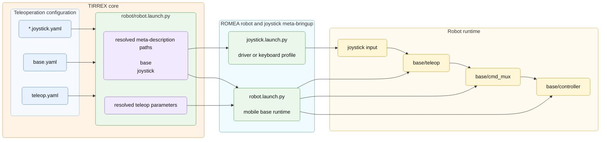

# Teleoperation Configuration

## Principle

Teleoperation converts joystick or keyboard inputs into commands that can be
sent to the robot runtime. In the current TIRREX demo, the main teleoperation
path commands the mobile base: the joystick driver publishes input messages,
`base/teleop` converts them into mobile base commands, and `base/cmd_mux`
forwards the selected command to `base/controller`.

Teleoperation can also be used for devices that move an implement, for example
a hitch or another actuated tool. In that case, the principle is the same: a
joystick mapping selects the user inputs, a teleoperation node converts them
into implement commands, and the corresponding controller applies these
commands. This part depends on the implement family and is not detailed in this
chapter yet.

## Mobile Base Configuration

Mobile base teleoperation uses:

```text
config/
  robot/
    teleop.yaml                edited in this chapter
    devices/
      remote_controller.joystick.yaml
    base.yaml
```

The teleoperation configuration defines the command message to publish, the
command priority used by the mobile base command mux, and the command ranges
available in slow and turbo modes.

Example:

```yaml
cmd_output:
  message_type: romea_mobile_base_msgs/TwoAxleSteeringCommand
  message_priority: 100
cmd_range:
  maximal_linear_speed:
    slow_mode: 1.0
    turbo_mode: 2.0
```

At launch time, the teleoperation setup combines:

* the joystick meta-description;
* the compact mobile base configuration;
* the teleoperation parameters;
* joystick remapping files from the joystick utilities package.

The output command is sent to the mobile base command mux when a mux priority is
configured.

The command message depends on the mobile base kinematic family:

| Kinematic family | Command message |
| --- | --- |
| Skid steering or differential drive | `romea_mobile_base_msgs/SkidSteeringCommand` |
| One steering axle or two-wheel steering | `romea_mobile_base_msgs/OneAxleSteeringCommand` |
| Two steering axles or four-wheel steering | `romea_mobile_base_msgs/TwoAxleSteeringCommand` |
| Omnidirectional steering | `romea_mobile_base_msgs/OmniSteeringCommand` |

The joystick mapping also depends on the kinematic family. The examples below
show the button layouts used by ROMEA for two common groups of mobile bases.

| Two-axle and four-wheel steering bases | Skid, differential and one-axle steering bases |
| --- | --- |
| `two_axle_steering`, `four_wheel_steering` | `skid_steering`, differential drive, `one_axle_steering`, `two_wheel_steering` |
| {width=7cm} | {width=7cm} |

## Implement Teleoperation

Implement teleoperation follows the same idea as mobile base teleoperation, but
the command message, remapping file and controller depend on the implement
family. This section will be completed when the implement teleoperation
configuration is documented in the corresponding packages.

## Launch Flow

The teleoperation runtime is assembled from the robot configuration directory.
TIRREX resolves the joystick meta-description, the mobile base configuration and
`teleop.yaml`, then forwards them to the ROMEA meta-bringup packages. The
joystick driver or keyboard profile publishes input messages. The mobile base
teleoperation node converts these inputs into commands, sends them to
`base/cmd_mux`, and the mux forwards the selected command to
`base/controller`.

Figure 8 - Teleoperation launch flow:


