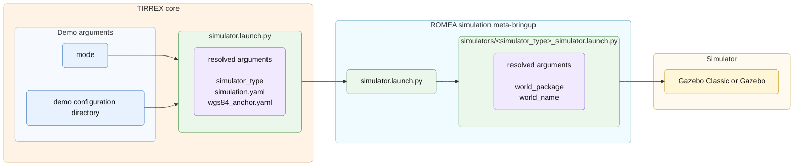

# Simulation Configuration

## Configuration

Simulation uses:

```text
config/
  simulation.yaml              edited in this chapter
  robot/
    base.yaml
    devices/
      *.yaml
```

The simulation configuration selects the simulator backend, the world to load
and the initial pose of each entity spawned in that world.

Example:

```yaml
simulators:
  gazebo_classic:
    world_package: romea_simulation_gazebo_worlds
    world_name: friction_cone.world
  gazebo:
    world_package: romea_simulation_gazebo_worlds
    world_name: gz_empty.sdf
entities:
  - name: adap2e
    initial_x: 0.0
    initial_y: 0.0
    initial_z: 0.0
    initial_roll: 0.0
    initial_pitch: 0.0
    initial_yaw: 90.0
```

The `simulators` section selects the world to load for each supported simulator.

### Simulation Modes

The demo is launched with a `mode` argument. In simulation, this mode is used to
deduce the simulator type. Once the simulator type is selected, TIRREX starts
the corresponding simulator and then spawns the robot or the requested entity.

| Mode | Simulator type |
| --- | --- |
| `simulation` | Automatically selects Gazebo Classic when `gazebo_ros` is available, otherwise Gazebo when `ros_gz` is available. |
| `simulation_gazebo_classic` | Uses `gazebo_classic`. |
| `simulation_gazebo` | Uses `gazebo`. |
| `simulation_isaac` | Reserved for future Isaac Sim integration. |

## Launch Flow

### Simulator Launch Flow

Starting the simulator is separate from spawning entities. The simulator launch
files use `simulation.yaml` to select the world and
`wgs84_anchor.yaml` to initialise the world geographic reference when the
selected backend supports it.

Inside TIRREX, the `mode` and the demo configuration directory are arguments of
`tirrex_core/launch/simulator.launch.py`. This launch file derives
`simulator_type` from the selected mode, resolves the paths to
`simulation.yaml` and `wgs84_anchor.yaml`, then forwards these three values to
`romea_simulation_meta_bringup/launch/simulator.launch.py`.

The ROMEA simulation launch then calls the backend-specific launch file:
`launch/simulators/<simulator_type>_simulator.launch.py`. This backend launch
file reads the simulator entry in `simulation.yaml` and resolves the world to
load.

Figure 9 - Simulator launch flow:



For Gazebo and Gazebo Classic, the selected world is loaded from
`world_package` and `world_name`. If the WGS84 anchor file is provided, the
world is saved with this anchor before the simulator is started.

The `world_package` field is optional. When it is omitted, or when it is set to
`gazebo`, the world file is searched in the simulator resource paths instead of
in a ROS2 package. The environment variable depends on the selected backend:
Gazebo Classic uses `GAZEBO_RESOURCE_PATH`, while Gazebo Sim / `gz` uses
`GZ_SIM_RESOURCE_PATH`. In both cases, the resource path must contain a
directory with a `worlds/<world_name>` file.

### Entity Spawn Flow

The entity launch spawns one object into an already started simulator. The
object can be a complete robot, a mobile base, a standalone sensor, a
manipulator or another entity, provided that the corresponding meta-bringup
package can generate a simulation URDF for it.

The `entities` section of `simulation.yaml` gives the initial pose of each
spawned entity.

Inside TIRREX, `robot/robot.launch.py` receives the selected `mode`,
`robot_namespace` and `robot_configuration_directory`. It generates the robot
meta-description, derives `simulator_type` from the mode and forwards the
entity arguments to `romea_simulation_meta_bringup/launch/entity.launch.py`.
The ROMEA simulation entity launch then generates the URDF in
`simulation_<simulator_type>` mode, reads the entity pose from
`simulation.yaml`, and calls the backend-specific
`simulators/<simulator_type>_entity.launch.py` file to spawn the entity.

When the entity name appears in the `entities` list, the configured pose is
used. Missing pose fields default to `0.0`. If no matching entry is found, the
entity is spawned at the default pose.

Figure 10 - Entity spawn flow:

```mermaid
flowchart LR
  subgraph tirrex_entity["TIRREX core"]
    direction LR
    subgraph inputs["Demo arguments"]
      direction TB
      mode["mode"]
      robot_namespace["robot_namespace"]
      robot_config["robot configuration directory"]
    end

    subgraph robot_launch["robot/robot.launch.py"]
      direction TB
      entity_args["resolved arguments<br/><br/>entity_type<br/>simulator_type<br/>namespace"]
      robot_meta["generate robot meta-description"]
    end
  end

  subgraph romea_entity["ROMEA simulation meta-bringup"]
    direction TB
    subgraph entity_launch["entity.launch.py"]
      direction TB
      entity_work["generated entity<br/><br/>URDF<br/>x y z r p y"]
    end
    backend_entity["simulators/&lt;simulator_type&gt;_entity.launch.py"]
  end

  subgraph spawn_step["Simulator"]
    direction TB
    spawn["Gazebo Classic or Gazebo"]
  end

  mode --> robot_launch
  robot_namespace --> robot_launch
  robot_config --> robot_launch
  robot_launch --> entity_launch
  entity_launch --> backend_entity
  backend_entity --> spawn

  classDef config fill:#e8f2ff,stroke:#5b8ec7,color:#111,rx:6,ry:6
  classDef tirrex fill:#f1eaff,stroke:#8b6fc6,color:#111,rx:6,ry:6
  classDef launch fill:#eaf7ea,stroke:#5c9f5c,color:#111,rx:6,ry:6
  classDef resolved_args fill:#f1eaff,stroke:#8b6fc6,color:#111,rx:6,ry:6
  classDef sim fill:#fff6d8,stroke:#c9a227,color:#111,rx:6,ry:6

  class mode,robot_namespace,robot_config config
  class robot_meta,entity_args,entity_work resolved_args
  class backend_entity launch
  class spawn sim

  style inputs fill:#f6faff,stroke:#9abbe3,rx:6,ry:6
  style robot_launch fill:#eaf7ea,stroke:#5c9f5c,rx:6,ry:6
  style tirrex_entity fill:#fff3e6,stroke:#d89b55,rx:6,ry:6
  style romea_entity fill:#f0fbff,stroke:#65a9c7,rx:6,ry:6
  style entity_launch fill:#eaf7ea,stroke:#5c9f5c,rx:6,ry:6
  style spawn_step fill:#fffaf0,stroke:#d4b24f,rx:6,ry:6
```



Future backends such as Isaac Sim or 4D Virtualiz can follow the same structure:
the simulator launch selects and starts the world, and the entity launch adapts
the generated description and spawn command to the backend.
