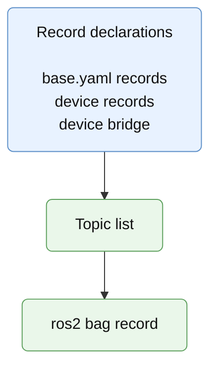

# Recording and Replay

Recording uses:

```text
config/
  records.yaml                 edited in this chapter
  robot/
    base.yaml                  contains base record flags
    devices/
      *.yaml                   contain device record flags
```

The recording configuration controls where bags and companion files are written,
and which optional context information is stored with the bag.

Example:

```yaml
directory: /path/to/records
config: true
debug: true
log: true
vcs: true
```

When `record:=true`, the record launch file:

1. builds a topic list from the `records` sections of the base and device
   meta-descriptions;
2. always records `/tf` and `/tf_static`;
3. records `/clock` or uses simulated time when the mode is a simulation mode;
4. optionally copies the demo configuration;
5. optionally exports repository state with `vcs`.

Figure 11 - Recorded topic selection:



Replay uses `replay.yaml` from the record directory to relaunch the demo context
and play the recorded bag.
