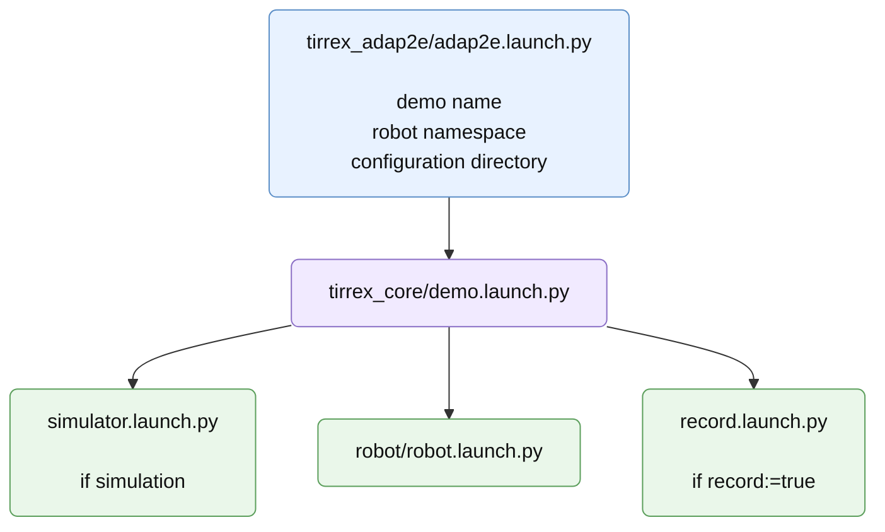

# Complete Adap2e Walkthrough

The Adap2e demo is a good full example because it contains most configuration
families. The package stores this configuration directory and provides a
convenience launch file, but the essential part is the `config/` directory:

```text
tirrex_adap2e/
  launch/
    adap2e.launch.py
  config/
    robot/
      base.yaml
      devices.yaml
      devices/
        remote_controller.joystick.yaml
        lms151.lidar.yaml
        septentrio.gps.yaml
        xsens.imu.yaml
        realsense.camera.yaml
        ur10.arm.yaml
        cultivator.implement.yaml
      localisation.yaml
      path_following.yaml
      path_matching.yaml
      teleop.yaml
    simulation.yaml
    wgs84_anchor.yaml
    records.yaml
    paths/
      cezeaux_line.traj
      cezeaux_slam1.traj
      cezeaux_test_v4.traj
```

Launch in simulation through the package wrapper:

```bash
ros2 launch tirrex_adap2e adap2e.launch.py mode:=simulation record:=false
```

The same configuration can be launched through `tirrex_core` by passing the
configuration directory explicitly. This is the generic launch form used by any
TIRREX demo:

```bash
ros2 launch tirrex_core demo.launch.py \
  demo:=tirrex_adap2e \
  demo_start_timestamp:=manual \
  demo_configuration_directory:=/path/to/tirrex_adap2e/config \
  robot_namespace:=adap2e \
  mode:=simulation \
  record:=false
```

Launch in simulation and record:

```bash
ros2 launch tirrex_adap2e adap2e.launch.py mode:=simulation record:=true
```

Launch in live mode:

```bash
ros2 launch tirrex_adap2e adap2e.launch.py mode:=live record:=false
```

The package-specific launch file is only a convenience wrapper around this
generic command. It selects the Adap2e demo values, then `tirrex_core` starts
the same generic sequence.

Figure 12 - Adap2e launch sequence:


